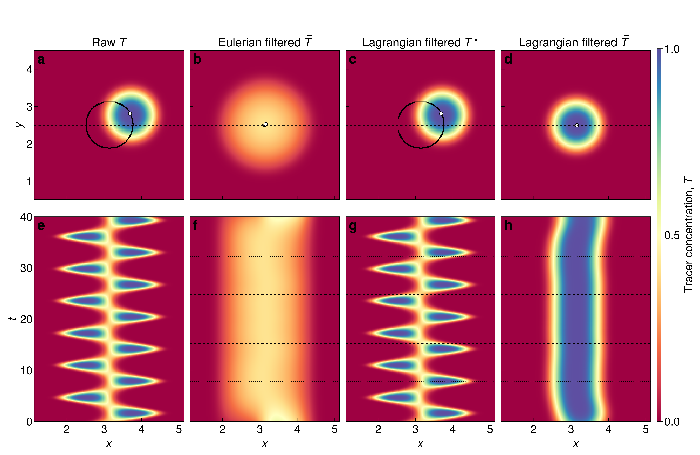
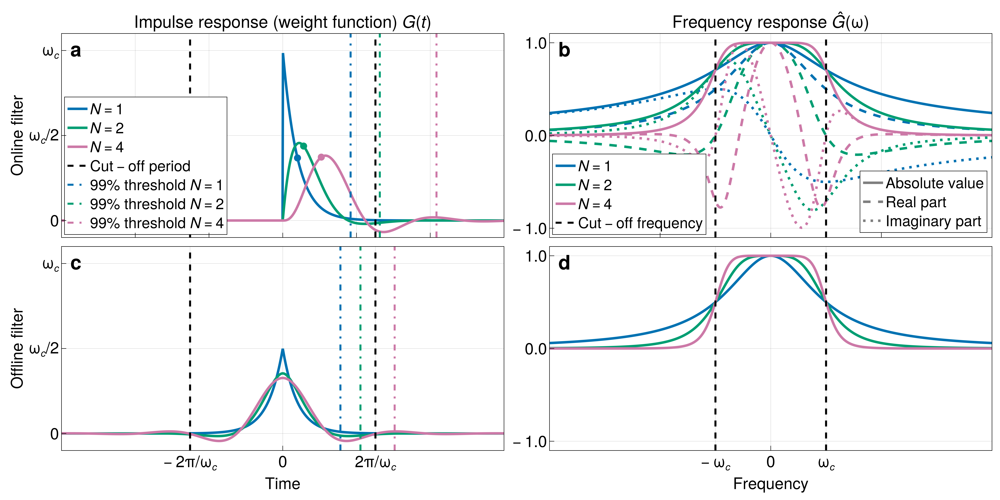

# Summary
Numerical fluid dynamical simulations of geophysical fluids, such as the ocean and the atmosphere, typically exhibit complex dynamics including vortices and waves. The analysis of these simulations often requires the high frequency component (usually the waves) to be removed from the output to allow analysis of the lower frequency component, which we refer to as the 'mean flow'. Alternatvely, the faster component may be of interest, and must be separated from the mean flow for analysis purposes. Eulerian temporal filtering (or equivalently 'time averaging') is most commonly used for this purpose -- at a given spatial location, a time average (perhaps with some weight function) can be found either by post-processing simulation output 'offline', or more commonly at simulation time by constructing the average cumulatively 'online'. However, it has long been recognised that a Lagrangian time average, in which the property of interest is averaged in the frame of a (moving) fluid parcel, defines a more physically relevant mean flow (@andrewsExactTheoryNonlinear1978). Furthermore, Lagrangian filtering, whereby waves are defined by an intrinisic (frame of flow) frequency criterion can most effectively decompose waves and mean flows [@bakerLagrangianFilteringWave2025]. Lagrangian filtering is usually performed using particle tracking methods, but its use has so far been limited by the extensive computational and memory requirements of the calculation. 

In this package, we implement methods for Lagrangian filtering based on the solution of partial differential equations (PDEs), building on recent theoretical developments [@kafiabadComputingLagrangianMeans2023, @bakerLagrangianFilteringWave2025, @minzEfficientLagrangianAveraging2025]. Although these methods are entirely generalisable to different numerical fluids solvers, here we implement them for use with the ``Oceananigans.jl`` ocean modelling framework. ``Oceananigans.jl`` is a popular and flexible Julia-based open source software package for finite volume simulations of 
the nonhydrostatic and hydrostatic Boussinesq equations on CPUs and GPUs. ``OceananigansLagrangianFilter.jl`` provides a user-friendly way for ``Oceananigans.jl`` users to analyse their simulations and gain new insights using Lagrangian filtering, either by post-processing their existing simulation output ('offline') or integrating the functionality into their simulations at run-time ('online'). 

# Statement of Need
- A section that clearly illustrates the research purpose of the software and places it in the context of related work. This should clearly state what problems the software is designed to solve, who the target audience is, and its relation to other work.
- Write definition equations
- Describe the two example use cases here.

Lagrangian filtering consists of finding, for some simulated scalar field $f(x,t)$, the generalised Lagrangian mean $\overline{f}^{\mathrm{L}}(\symbf{x},t)$ defined by
$$\overline{f}^{\mathrm{L}}(\bar{\symbf{\varphi}}(\symbf{a},t),t) = \int_{-\infty}^\infty G(t-s) f(\symbf{\varphi}(\symbf{a},s),s)\,\mathrm{d} s \,,$$
where $\symbf{\varphi(\symbf{a},t)}$ is the flow map, defining the position of a fluid particle with label $\symbf{a}$ at time $t$, $G(t)$ is some weight function (or equivalently the impulse response of the filter) 

Figures can be included like this:

and referenced from text using \autoref{fig:IO}.

Figures can be included like this:

and referenced from text using \autoref{fig:leewave}.

# State of the field
- A description of how this software compares to other commonly-used packages in the research area. If related tools exist, provide a clear “build vs. contribute” justification explaining your unique scholarly contribution and why existing alternatives are insufficient.
- Generally particle tracking, both online and offline. Online methods often suffer from clustering and interpolation errors, offline from memory requirements. In particular, it is generally necessary to track particles along an entire trajectory to find the Lagrangian mean at one timestep. 
- This method allows calculation of the Lagrangian mean/and or high frequency component at every timestep. 

# Software design
- An explanation of the trade-offs you weighed, the design/architecture you chose, and why it matters for your research application. This should demonstrate meaningful design thinking beyond a superficial code structure description.
- Several options for implementation of Lagrangian mean via PDEs - why I chose this one and offline and online options. 
- Offline and online (include figure of filter shapes) different uses in different contexts. Keep as much of Oceananigans infrastructure as possible, building on the existing constructors.
- Refer to equations? To demonstrate what is actually found by different methods, cite Baker 25 for f*. It is a choice to find f* first (no interpolation) 

and referenced from text using \autoref{fig:filtershape}.

# Research impact statement
- Evidence of realized impact (publications, external use, integrations) or credible near-term significance (benchmarks, reproducible materials, community-readiness signals). The evidence should be compelling and specific, not aspirational. 
- Makes available for implementation in other fluid dynamical solvers
- Analytical methods have been published, but this implementation allows the methods to be easily accessible to the community. 
- Useful for calculating Lagrangian means for saving as transport velocities

# AI usage disclosure
- Transparent disclosure of any use of generative AI in the software creation, documentation, or paper authoring. If no AI tools were used, state this explicitly. If AI tools were used, describe how they were used and how the quality and correctness of AI-generated content was verified.

# Acknowledgements
Thank NFFDy
We want to thank the [Climate Modeling Alliance](https://clima.caltech.edu) team and ``Oceananigans.jl`` contributors for their fantastic project. We also thank ``JuliaGPU`` contributors for ``KernelAbstractions.jl`` and ``CUDA.jl`` which make this code possible. 

# References